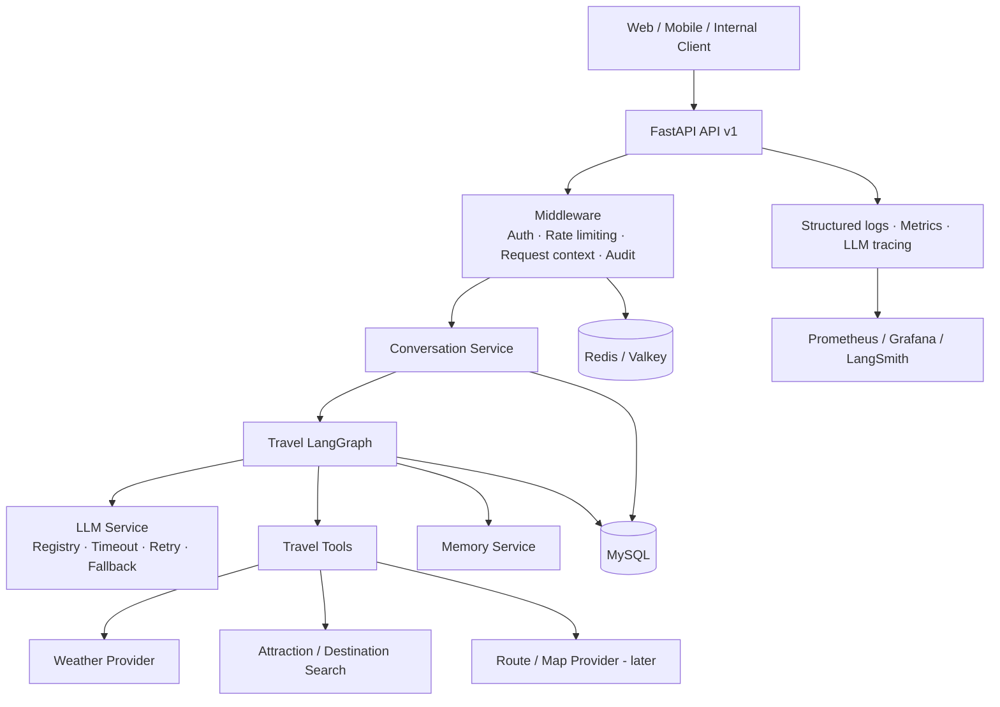
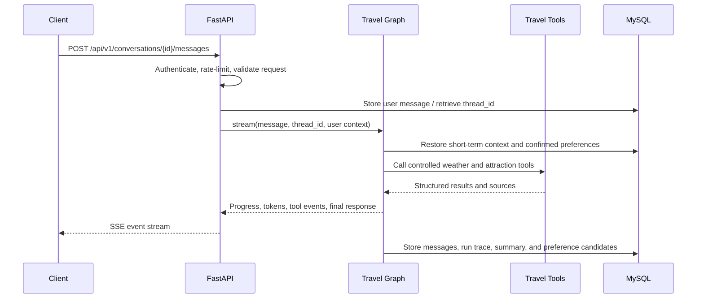
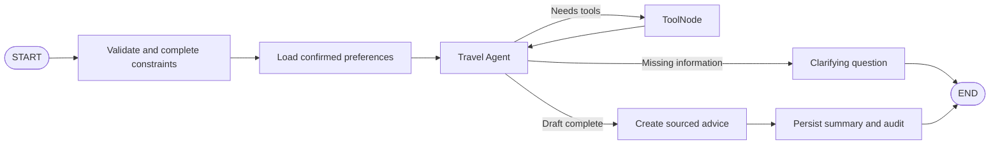

# Travel Assistant Backend Architecture Design

**Status:** Proposal  
**Last updated:** 2026-08-07  
**Applies to:** Building a deployable, maintainable FastAPI and LangGraph service from the engineering baseline

## 1. Context and goals

The repository now contains only an engineering baseline. The target system is a multi-user travel-assistant backend with HTTP APIs, conversation state, controlled external tools, operational safeguards, and observability.

This design takes inspiration from [fastapi-langgraph-agent-production-ready-template](https://github.com/wassim249/fastapi-langgraph-agent-production-ready-template): an API layer, LangGraph orchestration, independent services, database migrations, caching, authentication, rate limiting, observability, and evaluation. The first product scope is travel advice and itinerary drafts. Booking, payments, and other irreversible travel decisions are explicitly excluded.

### Goals

- Provide versioned, stream-capable HTTP APIs for travel conversations.
- Use LangGraph for multi-turn state, tool calls, recovery, and human approval.
- Persist conversations, messages, tool calls, and confirmed travel preferences.
- Isolate weather, attractions, routes, and map providers behind replaceable tools.
- Establish authentication, rate limiting, logs, metrics, traces, evaluations, and deployment foundations.

### Non-goals for the first release

- Hotel, flight, ticket, or attraction booking; payment; or ordering on a user's behalf.
- Unrestricted web scraping or arbitrary tool execution.
- Dynamic-pricing commitments, live inventory guarantees, or travel-insurance advice.
- Writing preferences to long-term memory without the user's explicit confirmation.

## 2. Architectural principles

- **Domain first:** Route handlers translate protocols only. Travel rules, tools, and Agent orchestration do not live in route handlers.
- **Explicit state:** Use a typed LangGraph `StateGraph` for execution paths. Nodes return partial state updates only.
- **Recoverable execution:** Every conversation has a stable `thread_id`; production uses a durable checkpoint backend selected for the Agent in P2, never in-memory state.
- **Controlled tools:** Tools use allowlists, parameter validation, timeouts, retries, and audit records. Results retain source and retrieval time.
- **Progressive delivery:** Build an observable travel-advice loop first, then add long-term memory, parallel retrieval, evaluation, and human collaboration.
- **Secure defaults:** Minimize personal-data retention. Load secrets only from the runtime environment. Require explicit confirmation for writes and future high-risk actions.

## 3. System overview



### Primary request flow



## 4. Technology choices

| Area | Preferred choice | Responsibility |
| --- | --- | --- |
| API | FastAPI + Pydantic v2 | REST, SSE, OpenAPI, request and response validation |
| Agent orchestration | LangGraph | Multi-turn state, conditional routing, tool loops, pause and resume |
| LLM integration | `langchain-openai` in OpenAI-compatible mode | `OPENAI_API_KEY`, `OPENAI_BASE_URL`, and `DEFAULT_LLM_MODEL` configuration |
| System-management data | MySQL 8.4 + SQLModel/SQLAlchemy + Alembic | Users, conversations, messages, runs, and migrations |
| LangGraph persistence | Durable checkpoint backend selected in P2 | Checkpoints by `thread_id`, recovery, and replay |
| Cache and rate limiting | Redis or Valkey, with explicit in-memory development fallback | Hot-query cache, idempotency keys, and rate limits |
| Vector retrieval (phase two) | Dedicated vector store, selected in P4 | Semantic retrieval of confirmed preferences and facts |
| Observability | Structured logging + Prometheus + LangSmith | Diagnostics, metrics, Agent tracing, and evaluation |
| Delivery | Docker, Docker Compose, CI | Consistent local environments, deployment, and automated checks |

Exact versions are locked in `pyproject.toml` and `uv.lock`. New Agent code uses LangChain and LangGraph 1.x rather than legacy 0.x packages.

## 5. Recommended project structure

```text
.
├── app/
│   ├── main.py                     # FastAPI application factory, lifespan, routing
│   ├── api/v1/
│   │   ├── router.py
│   │   ├── conversations.py         # Conversations, SSE, execution resume
│   │   ├── sessions.py               # Session management
│   │   ├── preferences.py            # Confirmed travel preferences
│   │   └── health.py
│   ├── core/
│   │   ├── config.py                 # Settings and environment configuration
│   │   ├── security.py               # JWT/API key and authorization
│   │   ├── middleware.py             # Request IDs, logging context, timings
│   │   ├── limiter.py
│   │   ├── cache.py
│   │   ├── prompts/                  # Versioned system prompts
│   │   └── langgraph/
│   │       ├── graph.py              # Graph assembly and compilation
│   │       ├── state.py              # TravelAgentState
│   │       ├── nodes/                # Routing, planning, answer, memory nodes
│   │       └── tools/                # Weather, attraction, route tools
│   ├── models/                       # ORM models
│   ├── schemas/                      # Pydantic API DTOs
│   ├── repositories/                 # Data-access boundary
│   ├── services/
│   │   ├── llm/                      # Model registry, retry, circuit breaker/fallback
│   │   ├── conversation.py
│   │   ├── memory.py
│   │   └── travel/                   # Domain services and provider adapters
│   └── observability/                # Metrics, tracing, audit
├── alembic/                          # Database migrations
├── tests/                            # Unit, integration, API, and regression tests
├── evals/                            # Travel evaluation datasets and reports
├── docs/
├── scripts/
├── Dockerfile
├── docker-compose.yml
├── .env.example
└── pyproject.toml
```

The repository currently retains only the baseline. Prompts and tools must be implemented directly in the modules above; no previous prototype is migrated.

## 6. Core domain and data model

### Conversation and short-term state

- `users`: identity and status. The first release can support anonymous users or API-key principals.
- `sessions`: login or access sessions. This can be deferred when the first release uses API keys only.
- `conversations`: a continuous conversation linked to `user_id`, `thread_id`, title, and archive state.
- `messages`: user, assistant, tool, and system messages with ordering, content, citations, and token usage.
- `agent_runs`: graph-execution status, model, duration, errors, and trace ID.
- `tool_calls`: tool name, redacted input, result summary, source, duration, and errors.

`conversations.thread_id` is the unique join key for LangGraph checkpoints. API calls must provide or receive a server-created conversation; process memory must not represent production session state.

### Long-term preferences and memory

- `travel_preferences`: budget range, party size, interests, dietary or accessibility needs, language, visited places, source, confirmation state, and expiration.
- Read only `confirmed` preferences by default. Model-extracted preferences are stored as candidates and become long-term memory only after confirmation.
- In phase two, create embeddings only for confirmed high-value data and retrieve them through user-scoped vector search. Do not indiscriminately store entire chat histories in a vector database.

## 7. LangGraph design

### State model

`TravelAgentState` contains at minimum:

- `messages`: a reducer-backed message sequence;
- `user_id`, `conversation_id`, and `thread_id`: execution ownership;
- `request_context`: language, timezone, client capabilities, and current date;
- `travel_constraints`: structured destination, dates, budget, companions, and interests;
- `retrieved_preferences`: read-only confirmed preferences;
- `tool_results`, `citations`, and `warnings`: reducer-backed accumulated results;
- `plan`, `final_answer`, `requires_confirmation`, and `run_status`: current outcome and control fields.

Nodes return partial updates and never mutate the entire state in place. List fields written by parallel nodes require reducers so results are not overwritten by the last writer.

### Initial graph



- `validate`: validates destination, dates, budget, and other constraints. It asks a clarifying question instead of calling external tools when essential details are missing.
- `load_memory`: reads confirmed preferences by user; it is skipped for anonymous users.
- `agent`: selects tools and plans the next step. It may only call registered tools.
- `tools`: runs through LangGraph `ToolNode`; tool failures are returned as recoverable results to the Agent. Transient network failures have bounded retries and timeouts.
- `compose`: produces advice, rationale, citations, data freshness, and uncertainty notices.
- `persist`: writes messages, run summaries, and audit records idempotently.

### Human confirmation

The graph may pause with `interrupt()` before saving preferences, generating a shareable itinerary, exporting a file, or performing any future booking action. Pauses require persistent checkpoints and the same `thread_id` to resume. Side effects before the pause must be idempotent or split into a node after the pause.

## 8. API design (v1)

| Method | Path | Purpose |
| --- | --- | --- |
| `GET` | `/health/live` | Process liveness probe |
| `GET` | `/health/ready` | Database and required dependency readiness probe |
| `POST` | `/api/v1/conversations` | Create a conversation and assign a `thread_id` |
| `GET` | `/api/v1/conversations` | List the current user's conversations with pagination |
| `GET` | `/api/v1/conversations/{id}` | Retrieve a conversation and messages |
| `POST` | `/api/v1/conversations/{id}/messages` | Submit a message and return JSON or an SSE stream |
| `POST` | `/api/v1/conversations/{id}/resume` | Resume an interrupted approval or clarification flow |
| `GET` | `/api/v1/preferences` | Read confirmed preferences |
| `PUT` | `/api/v1/preferences` | Explicitly update preferences |

SSE events use the types `meta`, `status`, `token`, `tool_call`, `tool_result`, `interrupt`, `final`, and `error`. Every event contains `request_id`, `conversation_id`, and `run_id`. Streaming and non-streaming responses use the same domain execution result rather than separate Agent implementations.

Errors follow a Problem Details-like shape with `code`, `message`, `request_id`, and optional safe-to-display `details`. Provider secrets, full stack traces, and unfiltered tool output are never returned to clients.

## 9. Travel-tool boundary

| Tool | Initial capability | Constraints |
| --- | --- | --- |
| `get_weather` | Retrieve destination weather and forecast | City normalization, timeout, and retrieval timestamp |
| `search_attractions` | Search attractions by city, weather, and preferences | Allowlisted providers, source URL, deduplication, and result limit |
| `get_destination_facts` | Retrieve opening hours, transit, or safety notices | Phase two; sources and freshness are mandatory |
| `build_itinerary` | Build an itinerary draft from verified data | Pure computation; no external side effect |
| `save_preference` | Save a confirmed preference | Explicit user confirmation and audit event required |

Tool inputs and outputs use Pydantic schemas. Every external call has connection and read timeouts, bounded retries, rate limits, and a cache policy. Volatile information such as weather and opening hours must display retrieval time; the model must not present search results as guarantees.

## 10. Security, reliability, and operations

### Security

- Use JWT or controlled API-key authentication in the first release. Inject identity into request context; never infer it from model text.
- Limit requests and concurrent streams by user and IP. Apply per-run tool-call counts, total duration, and cost budgets.
- Use `.env` only for local development. Production secrets come from a secret manager. Redact secrets and personal data from logs, traces, and audit records.
- Enforce user isolation in conversation reads, checkpoints, preference retrieval, cache keys, and evaluation datasets.

### Reliability

- The LLM service owns model configuration, total timeout budget, exponential backoff, and configurable fallback models. Business nodes do not construct provider clients directly.
- Retry transient network failures a bounded number of times; return LLM-recoverable tool errors to the graph; request user input for missing information; alert on unexpected errors and return a traceable request ID.
- Use idempotency keys for external writes. Future exports and bookings require audit records and confirmation.

### Observability and quality

- Every log line includes `request_id`, redacted `user_id`, `conversation_id`, `thread_id`, `run_id`, and trace ID.
- Core metrics: request volume, latency, error rate, time to first token, completion time, tool success rate and latency, model usage and cost, rate-limit events, and graph interruption/resume events.
- Retain a trace for every Agent run. LangSmith is recommended for the first release. If the team already uses Langfuse, use an observability adapter so business code remains vendor-neutral.
- Maintain Chinese travel-query evaluation data under `evals/`, covering weather consistency, source citations, constraint adherence, clarification quality, tool-failure recovery, and safety boundaries.

## 11. Deployment and environments

- Local: Docker Compose starts MySQL and later Redis or Valkey; Prometheus and Grafana are optional.
- Test: use an isolated database and secrets, apply migrations, then run unit, integration, API, and evaluation smoke tests.
- Production: containerize the service, run Alembic migrations once, and run multiple API replicas. System-management data lives in MySQL; session and checkpoint storage are never held only in process memory.
- Configure environments through environment variables. `.env.example` lists safe placeholders only; development, test, and production use separate values.

## 12. Release acceptance criteria

The first production candidate must satisfy all of the following:

- Multi-turn travel advice works through protected v1 APIs with SSE streaming.
- A conversation can resume its LangGraph state after a process restart.
- Weather and attraction tools have schemas, timeouts, failure handling, and sources with retrieval times.
- Every request has correlated logs, basic metrics, and an Agent trace.
- Database migrations, tests, code checks, and a minimum evaluation run in CI.
- No real secret is committed; user data, cache, and memory are isolated by identity.

## 13. References

- [fastapi-langgraph-agent-production-ready-template](https://github.com/wassim249/fastapi-langgraph-agent-production-ready-template): reference for project layering, persistence, observability, and operations.
- [LangGraph persistence](https://docs.langchain.com/oss/python/langgraph/persistence): basis for thread, checkpoint, and persistence design.
- [LangGraph overview](https://docs.langchain.com/oss/python/langgraph/overview): state graphs, nodes, and conditional routing.
