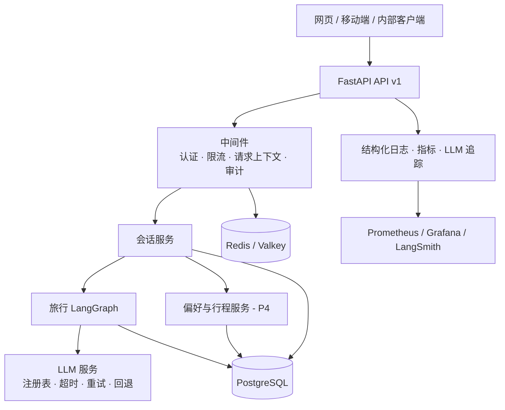
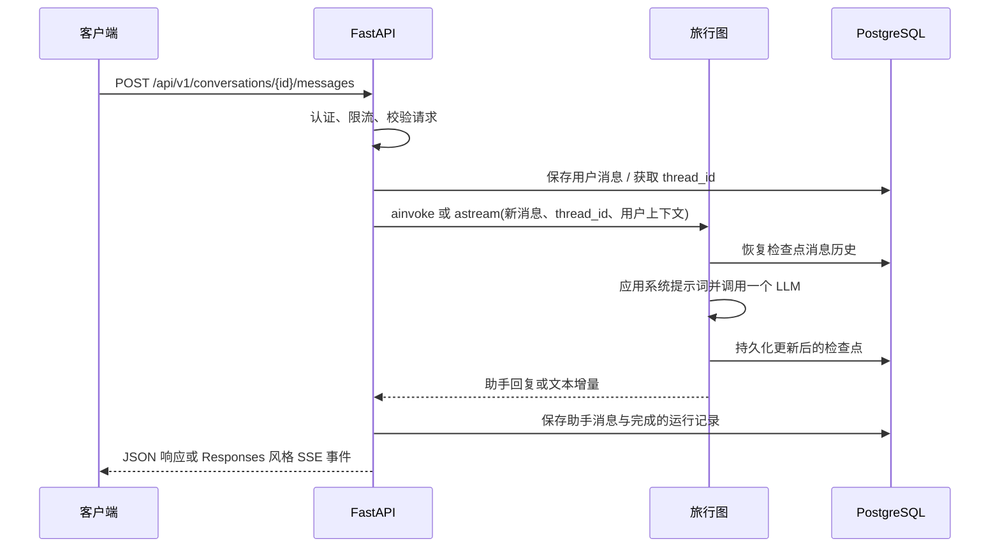

# Travel Assistant 后端架构设计

[English version](architecture-design.md)

**状态：** 已批准的目标架构；P2.0 单 Agent 对话闭环已实现
**最后更新：** 2026-08-14
**适用范围：** 在工程基线上构建可部署、可维护的 FastAPI 与 LangGraph 服务

## 1. 背景与目标

仓库现已具备工程与认证基础，以及持久化的单 Agent 对话闭环。目标系统是一个本地认证、多账户的旅行助手后端，包含 HTTP API、会话状态、受控外部工具、运行保障和可观测性。

设计参考 [fastapi-langgraph-agent-production-ready-template](https://github.com/wassim249/fastapi-langgraph-agent-production-ready-template) 的分层、编排、服务、迁移、缓存、认证、限流、可观测与评估思路。首期产品范围是旅行建议和行程草案；预订、支付及其他不可逆旅行决策明确不在范围内。

### 目标

- 提供版本化、支持流式传输的旅行对话 HTTP API。
- 使用 LangGraph 管理多轮状态、工具调用、恢复与人工确认。
- 持久化会话、消息、工具调用和已确认的旅行偏好。
- 将天气、景点、路线和地图供应商隔离在可替换工具之后。
- 建立认证、限流、日志、指标、追踪、评估和部署基础。

### 首个版本的非目标

- 代用户预订酒店、航班、票务或景点，支付或下单。
- 不受限制的网页抓取或任意工具执行。
- 动态价格承诺、实时库存保证或旅行保险建议。
- 未经用户明确确认即把偏好写入长期记忆。

## 2. 架构原则

- **领域优先：** 路由处理器只转换协议；旅行规则、工具和 Agent 编排不放在路由中。
- **显式状态：** 执行路径使用类型化 LangGraph `StateGraph`；节点只返回局部状态更新。
- **可恢复执行：** 每个会话都有公开 `conversation_id` 与稳定内部 `thread_id`；生产环境使用 P2 选定的持久化检查点后端，绝不依赖内存状态。
- **受控工具：** 工具必须具备白名单、参数校验、超时、重试和审计记录；结果保留来源与获取时间。
- **渐进交付：** 先交付可观测的旅行建议闭环，再扩展长期记忆、检索、评估和人工协作。
- **安全默认值：** 最小化个人数据留存；仅从运行环境读取密钥；写操作与未来高风险操作都要求明确确认。

## 3. 系统总览



这是平台边界图。P2–P5 始终只使用一个 Travel Agent 节点作为图编排单元；偏好、行程、可观测和发布能力通过 API 与应用服务添加在该节点周围，不引入图路由、`ToolNode` 循环或多 Agent 委派。

### 当前 P2.0 请求流



## 4. 技术选型

| 领域 | 首选方案 | 职责 |
| --- | --- | --- |
| API | FastAPI + Pydantic v2 | REST、SSE、OpenAPI、请求与响应校验 |
| Agent 编排 | LangGraph | P2–P5 固定为带检查点的 `START → agent → END`；无路由与工具循环 |
| LLM 集成 | OpenAI 兼容模式下的 `langchain-openai` | `OPENAI_API_KEY`、`OPENAI_BASE_URL`、`DEFAULT_LLM_MODEL` 和可选 `FALLBACK_LLM_MODEL` |
| 系统数据 | PostgreSQL 16 + SQLModel/SQLAlchemy + Alembic | 用户、会话、消息、运行记录与迁移 |
| LangGraph 持久化 | PostgreSQL 上的 `PostgresSaver` | 按 `thread_id` 保存检查点、恢复与回放 |
| 缓存与限流 | Redis 或 Valkey，显式开发内存回退 | 热查询缓存、幂等键和限流 |
| 向量检索（第二阶段） | 在 P4 选择专用向量库 | 已确认偏好和事实的语义检索 |
| 可观测性 | 结构化日志 + Prometheus + LangSmith | 诊断、指标、Agent 追踪与评估 |
| 交付 | Docker、Docker Compose、CI | 一致本地环境、部署与自动检查 |

准确版本固定在 `pyproject.toml` 与 `uv.lock`；新 Agent 代码使用 LangChain/LangGraph 1.x，而不是旧 0.x 包。

## 5. 推荐项目结构

```text
app/                 # API、配置、模型、schemas、服务和可观测模块
alembic/             # 数据库迁移
tests/               # 单元、集成、API 与回归测试
evals/               # 旅行评估数据与报告
docs/ scripts/       # 文档与运维脚本
docker-compose.yml   # 本地 PostgreSQL 与 Valkey
.env.example         # 安全的配置占位符
```

当前仓库已包含工程基线、SQLModel 表元数据、Alembic 基础、`app/agent/travel.py` 中的单节点图，以及 `app/services/llm.py` 中的 OpenAI 兼容 LLM 服务。提示词和未来工具直接在 `app/` 下实现，不迁移旧原型。

## 6. 核心领域与数据模型

### 会话与短期状态

完整业务 Schema、索引策略、留存、MinIO 附件边界与 LangGraph Schema 边界见[数据库设计](database-design.zh-CN.md)。

- `users`：身份与状态；首期只支持已认证用户。
- `auth_sessions`、`refresh_tokens`、`revoked_access_tokens`：密码登录会话、轮换刷新令牌与 JWT 撤销状态。
- `conversations`：直接关联 `user_id`、`thread_id`、标题与归档状态的连续会话。
- `messages`：带顺序、内容、引用与 token 用量的用户、助手、工具和系统消息。
- `agent_runs`：图运行状态、模型、时长、错误与 trace ID。
- `tool_calls`：工具名、脱敏输入、结果摘要、来源、耗时与错误。

公开且不可猜测的 `conversation_id` 与内部 `thread_id` 一对一对应；后者是 LangGraph 检查点的唯一连接键。每次读取、写入、流式传输和恢复均须核验已认证用户对会话的所有权。

### 长期偏好与记忆

- `travel_preferences` 保存预算、人数、兴趣、饮食/无障碍需求、语言、到访地点、来源、确认状态和到期时间。
- 默认只读取 `confirmed` 偏好；模型提取值先作为候选项，确认后才成为长期记忆。
- 第二阶段只为已确认的高价值数据创建嵌入，并使用用户隔离的向量检索；不得把整段聊天记录无差别写入向量库。

## 7. LangGraph 设计

### 当前单 Agent 状态模型

`TravelAgentState` 仅包含可序列化的 `user`/`assistant` 消息序列及返回 API 层的最新 `final_answer`。`user_id`、`conversation_id` 与 LLM 客户端属于请求范围的 `TravelAgentContext`，不属于检查点状态；`thread_id` 在调用配置中传递并划定 PostgreSQL 检查点序列。

### 当前图


每条提交的用户消息都会恢复对应 `thread_id` 历史、前置 `TRAVEL_ASSISTANT_SYSTEM_PROMPT`、调用主模型（可选备用模型）并写回检查点。API 服务在图外持久化同一份用户/助手转录与运行记录。

此阶段刻意不包含预校验节点、记忆加载节点、`ToolNode`、路由或 `interrupt()`。SSE 只是同一 Agent 节点 token 事件的 API 表示，而不是新增图节点。

### 演进规则与人工确认

所有后续里程碑保留上述图。实现可以扩展系统提示词，并传入已确认偏好、区域设置或预制行程草案等有界、服务端拥有的运行时上下文，但不得增加图节点、条件边、`ToolNode`、`Send` 或多 Agent supervisor。

消息、运行记录、偏好、确认与未来行程版本均是应用拥有的数据；API 和服务在一次 Agent 调用前后完成鉴权、校验、审计与持久化。模型建议永不等同于已确认偏好或不可逆动作。偏好写入、行程导出、分享链接及未来预订都要求 API 层明确确认，不使用 LangGraph `interrupt()`。

## 8. API 设计（v1）

完整契约见[会话 API 与身份契约](conversation-api-design.zh-CN.md)。API 使用稳定的 OpenAI **Responses** 词汇：一个新 `input` 产生一个带类型化 `output` 的 `response`，流则由有序 `response.*` 事件组成。DTO 覆盖文本、图片、文件和函数工具，但当前执行刻意仅支持无工具的文本。

| 方法 | 路径 | 用途 |
| --- | --- | --- |
| `GET` | `/health/live` | 进程存活探针 |
| `GET` | `/health/ready` | 数据库及必要依赖就绪探针 |
| `POST` | `/api/v1/conversations` | 创建会话并分配 `thread_id` |
| `GET` | `/api/v1/conversations` | 分页列出当前用户会话 |
| `GET` | `/api/v1/conversations/{id}` | 读取会话和消息 |
| `POST` | `/api/v1/conversations/{id}/messages` | 提交消息，返回 JSON 或 SSE |

文本流会发送 `response.created`、`response.in_progress`、输出项/内容新增、`response.output_text.delta` 与最终 `response.completed`；失败时发送 `response.failed` 和 `error`。每个事件都带递增 `sequence_number`。错误使用包含 `code`、`message`、`request_id` 及可选安全 `details` 的 Problem Details 风格结构。

## 9. 旅行工具边界

| 工具 | 初始能力 | 约束 |
| --- | --- | --- |
| `get_weather` | 获取目的地天气与预报 | 城市标准化、超时、获取时间 |
| `search_attractions` | 按城市、天气、偏好搜索景点 | 供应商白名单、来源 URL、去重和结果上限 |
| `get_destination_facts` | 营业时间、交通或安全提示 | 第二阶段，来源与时效必填 |
| `build_itinerary` | 基于验证数据生成行程草案 | 纯计算，无外部副作用 |
| `save_preference` | 保存已确认偏好 | 必须用户明确确认并记录审计事件 |

工具输入输出使用 Pydantic Schema。外部调用必须有连接/读取超时、有限重试、限流和缓存策略；天气、营业时间等易变信息须标示获取时间，模型不得将检索结果表述为保证。

## 10. 安全、可靠性与运维

- **安全：** 只允许已认证本地账户；短期 JWT 与轮换刷新令牌；在解析 `thread_id` 前验证会话所有权；每会话串行运行并要求 `Idempotency-Key`；按用户/IP 限流；生产密钥来自密钥管理器；日志与追踪中脱敏秘密和个人数据。
- **可靠性：** LLM 服务统一负责模型配置、总超时预算、指数退避和备用模型；短暂网络错误有限重试；用户可修复问题由提示词澄清；意外错误告警并返回可追踪请求 ID。
- **可观测性：** 日志关联 `request_id`、脱敏 `user_id`、`conversation_id`、`thread_id`、`run_id` 与 trace ID；跟踪请求量、延迟、错误率、首 token 时间、成本、限流和流完成率；维护中文旅行查询评估集。

## 11. 部署、环境与验收

- 本地使用 Docker Compose 启动 PostgreSQL 和后续 Redis/Valkey；Prometheus/Grafana 可选。
- 测试使用隔离数据库与密钥，执行迁移后运行单元、集成、API 和评估冒烟测试。
- 生产环境容器化服务，每次发布只执行一次 Alembic 迁移并启动多个 API 副本；系统数据与检查点都保存在 PostgreSQL，不仅存在进程内存。

首个生产候选必须满足：受保护 v1 API 支持 SSE 多轮旅行建议；进程重启后可恢复图状态；天气/景点工具具备 Schema、超时、失败处理与来源时间；请求具有关联日志、基础指标和 Agent trace；CI 运行迁移、测试、代码检查和最低评估；不提交真实密钥且按身份隔离用户数据、缓存与记忆。

## 12. 参考资料

- [fastapi-langgraph-agent-production-ready-template](https://github.com/wassim249/fastapi-langgraph-agent-production-ready-template)
- [LangGraph persistence](https://docs.langchain.com/oss/python/langgraph/persistence)
- [LangGraph overview](https://docs.langchain.com/oss/python/langgraph/overview)
