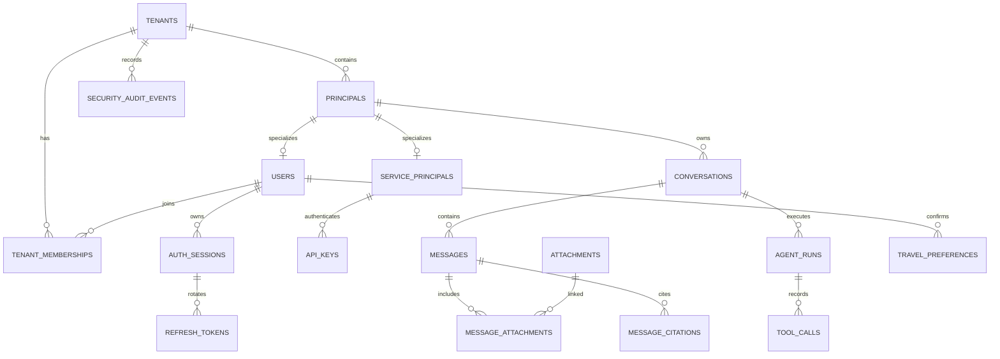

# Travel Assistant Database Design

**Status:** SQLModel definitions and the initial Alembic migration implemented
**Last updated:** 2026-08-10
**Database:** PostgreSQL 16 for relational data and LangGraph checkpoints; MinIO for attachment objects

Migration commands, revision-review rules, deployment sequencing, and ownership
boundaries are documented in the [Database migration guide](database-migrations.md).

## 1. Scope and decisions

This document defines the target relational design for the first release. The initial Alembic revision creates all current application-owned tables so foreign-key and tenant-isolation boundaries are stable from the outset. Product capabilities are enabled incrementally; a capability must not use a table before its service, authorization, and retention behavior are implemented.

Confirmed decisions:

- Users register and log in through this service; passwords use Argon2id hashes.
- JWT access tokens last 15 minutes. Refresh tokens rotate and are persisted/revocable.
- There are no anonymous conversations.
- Every user receives a personal tenant/workspace. The schema supports future team tenants without changing ownership keys.
- `user` and `service` are the only principal types in the first release. API keys authenticate service principals and cannot access user-owned conversations.
- The business tables are the authoritative source for frontend conversation history. LangGraph checkpoint tables are internal execution state only.
- The first release processes text. The API and storage model reserve content parts and attachments for image/file and later multimodal processing.
- Files live in MinIO; PostgreSQL stores only metadata, object location, integrity data, and scan state.
- A conversation permits at most one active run. Message submissions are idempotent.

## 2. Storage boundaries and schemas

| Boundary | Owner | Contents | Frontend reads it? |
| --- | --- | --- | --- |
| `app` PostgreSQL schema | Application migrations | Identity, tenants, conversations, messages, attachments, runs, audit, retention | Yes, through API only |
| `langgraph` PostgreSQL schema | `PostgresSaver` setup/migrations | Checkpoints and writes required to resume graph state | No |
| MinIO bucket | Attachment service | Original image/file bytes | Only through short-lived, authorized download URLs |
| Redis/Valkey | Runtime infrastructure | Rate limits, short-lived locks, optional idempotency cache | No |

`PostgresSaver` must use the same PostgreSQL cluster but a separate `langgraph` schema and its setup must run once during deployment, not on every application start. Its tables are dependency-owned: application migrations do not query, alter, or use them to render history. The application stores only the durable `thread_id` that lets a run invoke the graph with the correct checkpoint sequence.

## 3. Conventions and integrity rules

- All application identifiers are application-generated UUIDv7 values and use PostgreSQL `uuid` columns. They are opaque public identifiers; no sequential IDs are exposed.
- All timestamps are `timestamptz` in UTC. Application code supplies `created_at` and `updated_at`; deletion and expiry timestamps are never inferred from client time.
- All tenant-scoped tables contain `tenant_id`. Foreign-key relationships between tenant-scoped tables use the pair `(id, tenant_id)`, backed by a matching `UNIQUE (id, tenant_id)` on the parent. This prevents a programming error from linking records across tenants.
- `jsonb` stores extensible structured values. It is not a substitute for columns used by authorization, joins, ordering, retention, or the normal history screens.
- Enum-like fields are PostgreSQL `text` with `CHECK` constraints in P1. New values then require an explicit migration without the operational constraints of PostgreSQL enum replacement.
- Business data is soft-deleted first (`deleted_at`, `deleted_by_principal_id` where applicable) and later physically purged by `data_deletion_requests`. Foreign keys use `RESTRICT` unless the document explicitly says otherwise; purge order is intentional and auditable.
- No raw password, refresh token, API-key secret, reset token, or verification token is stored. Only a cryptographic hash and a non-secret display prefix where needed are persisted.

## 4. Entity relationship overview

## 5. Identity, tenant, and credential tables

### `tenants` — P1

One personal workspace is created transactionally with each user. Team tenants are not exposed in the first release, but tenant isolation is already the primary data boundary.

| Column | Type | Constraints / meaning |
| --- | --- | --- |
| `id` | `uuid` | PK |
| `kind` | `text` | `personal` now; future `team`; `CHECK` |
| `name` | `text` | Personal workspace display name |
| `status` | `text` | `active`, `suspended`, `deleted` |
| `created_at`, `updated_at` | `timestamptz` | Not null |
| `deleted_at` | `timestamptz` | Nullable soft delete |

Indexes: PK `id`; `INDEX (status) WHERE deleted_at IS NULL`. There is no user-visible tenant list yet, so no name-search index.

### `principals` — P1

The single ownership subject for tenant resources. A principal is either a user or a machine service. This avoids polymorphic `owner_type`/`owner_id` columns and makes authorization FK-safe.

| Column | Type | Constraints / meaning |
| --- | --- | --- |
| `id` | `uuid` | PK |
| `tenant_id` | `uuid` | FK `(tenant_id)` → `tenants`; part of tenant-scoped parent key |
| `kind` | `text` | `user` or `service` |
| `status` | `text` | `active`, `suspended`, `deleted` |
| `display_name` | `text` | Non-secret label |
| `created_at`, `updated_at`, `deleted_at` | `timestamptz` | Lifecycle timestamps |

Constraints and indexes: `UNIQUE (id, tenant_id)`; `INDEX (tenant_id, status) WHERE deleted_at IS NULL`; `CHECK (kind IN ('user', 'service'))`.

### `users` — P1

`users.principal_id` is both PK and FK to the matching `principals` row. An access JWT uses this UUID as `sub`; the request resolver derives `principal_id` and `tenant_id` from it. Email is globally unique because it is a login identifier.

| Column | Type | Constraints / meaning |
| --- | --- | --- |
| `principal_id` | `uuid` | PK; FK → `principals(id)`; must reference a `user` principal |
| `tenant_id` | `uuid` | Composite FK with `principal_id` → `principals`; the user's personal tenant |
| `email` | `text` | Original display form; not null |
| `email_normalized` | `text` | Trimmed/lowercase login lookup value; not null |
| `password_hash` | `text` | Argon2id encoded hash only |
| `status` | `text` | `pending_verification`, `active`, `disabled`, `deleted` |
| `email_verified_at` | `timestamptz` | Required before normal use |
| `password_changed_at` | `timestamptz` | Security audit and session invalidation |
| `security_invalid_before` | `timestamptz` | JWT issued before this time is rejected |
| `last_login_at`, `created_at`, `updated_at`, `deleted_at` | `timestamptz` | Lifecycle timestamps |

Constraints and indexes: `UNIQUE (email_normalized) WHERE deleted_at IS NULL`; `INDEX (status) WHERE deleted_at IS NULL`; `CHECK (email_normalized = lower(email_normalized))`. A trigger or service-level transaction verifies that the referenced principal has `kind = 'user'` and the same tenant as the membership created below.

### `tenant_memberships` — P1

This retains future team compatibility while every initial user is the sole `owner` of a personal tenant.

| Column | Type | Constraints / meaning |
| --- | --- | --- |
| `tenant_id` | `uuid` | FK → `tenants` |
| `user_principal_id` | `uuid` | FK → `users(principal_id)` |
| `role` | `text` | Only `owner` in first release; future `admin`, `member` |
| `status` | `text` | `active`, `invited`, `removed` |
| `created_at`, `updated_at`, `removed_at` | `timestamptz` | Lifecycle timestamps |

Primary key: `(tenant_id, user_principal_id)`. Index: `INDEX (user_principal_id, status)` for future tenant resolution.

### `auth_sessions` — P1

One row represents a refresh-token family/device session, not an individual JWT. It enables “log out this device” and “log out all devices”.

| Column | Type | Constraints / meaning |
| --- | --- | --- |
| `id` | `uuid` | PK; also JWT `sid` claim |
| `tenant_id`, `user_principal_id` | `uuid` | Composite FK to the active user/tenant relationship |
| `token_family_id` | `uuid` | Stable family identifier; unique |
| `created_at`, `last_used_at`, `expires_at` | `timestamptz` | Session lifecycle |
| `revoked_at`, `revoked_reason` | `timestamptz`, `text` | Null until revoked |
| `user_agent` | `text` | Truncated to a safe limit |
| `ip_hash` | `bytea` | Salted/HMAC hash, never raw IP |

Indexes: PK `id`; `UNIQUE (token_family_id)`; `INDEX (user_principal_id, expires_at DESC) WHERE revoked_at IS NULL`; `INDEX (expires_at)` for cleanup.

### `refresh_tokens` — P1

Each rotation creates a new row. Keeping consumed tokens permits detection of refresh-token reuse: reuse revokes the whole `auth_sessions.token_family_id`.

| Column | Type | Constraints / meaning |
| --- | --- | --- |
| `id` | `uuid` | PK; opaque token identifier |
| `session_id` | `uuid` | FK → `auth_sessions` |
| `token_hash` | `bytea` | Unique hash of the full refresh token |
| `issued_at`, `expires_at` | `timestamptz` | Not null |
| `consumed_at` | `timestamptz` | Set during successful rotation |
| `revoked_at` | `timestamptz` | Set if invalidated |
| `replaced_by_id` | `uuid` | Nullable self-FK → `refresh_tokens` |

Indexes: PK `id`; `UNIQUE (token_hash)`; `INDEX (session_id, issued_at DESC)`; `INDEX (expires_at)` for purge.

### `revoked_access_tokens` and `auth_one_time_tokens` — P1

`revoked_access_tokens` supports immediate access-JWT invalidation before its 15-minute expiry. It contains `jti` (PK), `user_principal_id`, `expires_at`, `revoked_at`, and `reason`; index `expires_at` supports cleanup.

`auth_one_time_tokens` supports email verification and password reset. Columns are `id` (PK), `user_principal_id` (not null), `purpose` (`email_verify` or `password_reset`), `token_hash` (unique), `expires_at`, `consumed_at`, `created_at`, `request_ip_hash`, and `request_user_agent`. Index `(user_principal_id, purpose, created_at DESC)` supports rate limiting and invalidating earlier tokens; `expires_at` supports purge.

### `service_principals` and `api_keys` — P3 capability

`service_principals.principal_id` is a PK/FK to `principals`, with `tenant_id`, `name`, `description`, `created_by_user_principal_id`, and lifecycle timestamps. The `(principal_id, tenant_id)` pair is a composite FK to `principals` and must reference `kind = 'service'`.

`api_keys` supports several keys per service principal:

| Column | Type | Constraints / meaning |
| --- | --- | --- |
| `id` | `uuid` | PK |
| `tenant_id`, `service_principal_id` | `uuid` | Composite FK to its service principal |
| `name` | `text` | Human-management label |
| `key_prefix` | `text` | Non-secret lookup/display prefix |
| `secret_hash` | `bytea` | Unique hash; plaintext only shown at creation |
| `scopes` | `jsonb` | Validated array; first-release scope is `chat:invoke` |
| `created_at`, `last_used_at`, `expires_at`, `revoked_at` | `timestamptz` | Lifecycle |
| `created_by_user_principal_id` | `uuid` | Audit origin |

Indexes: `UNIQUE (secret_hash)`; `INDEX (key_prefix)`; `INDEX (service_principal_id, expires_at) WHERE revoked_at IS NULL`; `INDEX (expires_at)` for cleanup. Key prefixes are never authorization material.

## 6. Conversation history and attachment tables

### `conversations` — P1

The frontend lists and opens this table; the Agent uses `thread_id` only after the conversation is authorized. A newly created conversation belongs to exactly one principal and tenant.

| Column | Type | Constraints / meaning |
| --- | --- | --- |
| `id` | `uuid` | PK; public `conversation_id` |
| `tenant_id`, `owner_principal_id` | `uuid` | Composite FK → `principals` |
| `thread_id` | `uuid` | Internal LangGraph key; globally unique and immutable |
| `title` | `text` | Nullable until derived or user set |
| `title_source` | `text` | `system`, `user`, or null |
| `status` | `text` | `active`, `archived`, `deleted` |
| `metadata` | `jsonb` | Validated locale/timezone/client hints only |
| `last_message_at` | `timestamptz` | Drives history-list ordering |
| `latest_message_sequence` | `bigint` | Last committed linear message sequence |
| `version` | `integer` | Optimistic update version, starts at 1 |
| `archived_at`, `deleted_at`, `purge_after_at` | `timestamptz` | Lifecycle/retention |
| `deleted_by_principal_id` | `uuid` | Nullable audit reference |
| `created_at`, `updated_at` | `timestamptz` | Not null |

Constraints and indexes:

- `UNIQUE (thread_id)` and `UNIQUE (id, tenant_id)`.
- `INDEX (tenant_id, owner_principal_id, last_message_at DESC, id DESC) WHERE deleted_at IS NULL` for the normal frontend conversation list.
- `INDEX (tenant_id, status, last_message_at DESC) WHERE deleted_at IS NULL` for administrative cleanup/listing.
- `INDEX (purge_after_at) WHERE deleted_at IS NOT NULL` for the purge worker.
- `CHECK (latest_message_sequence >= 0)` and `CHECK (version > 0)`.

No full-text index is created initially. History is paginated by `(last_message_at, id)`; title or message search is a later product feature that needs a deliberate language/search design.

### `messages` — P1

This is the canonical, ordered transcript for UI history and API retrieval. It is not rebuilt from checkpoints. A conversation is linear in the first release: edits, regenerated alternatives, and branches are intentionally absent.

| Column | Type | Constraints / meaning |
| --- | --- | --- |
| `id` | `uuid` | PK; public message ID |
| `tenant_id`, `conversation_id` | `uuid` | Composite FK → `conversations` |
| `sequence` | `bigint` | Strictly increasing within a conversation, starts at 1 |
| `role` | `text` | `user`, `assistant`, `system`, or `tool`; clients submit only `user` |
| `content` | `jsonb` | Canonical ordered content-part array |
| `rendered_text` | `text` | Nullable text projection for current rendering and compatibility |
| `content_status` | `text` | `complete`, `partial`, `failed`, `redacted` |
| `agent_run_id` | `uuid` | Nullable FK → `agent_runs`; ties output to its run |
| `model_alias` | `text` | Nullable; assistant output provenance |
| `token_count` | `integer` | Nullable provider accounting |
| `created_at`, `updated_at`, `deleted_at` | `timestamptz` | Lifecycle |

For P1, `content` accepts only text parts such as `[{"type":"text","text":"..."}]`; `rendered_text` is the same text. The shape reserves `image`, `file`, `audio`, and structured parts for later migrations without treating their bytes as relational data.

Constraints and indexes:

- `UNIQUE (id, tenant_id)` and `UNIQUE (conversation_id, sequence)`.
- `INDEX (conversation_id, sequence ASC) WHERE deleted_at IS NULL` is the primary history-query index.
- `INDEX (agent_run_id) WHERE agent_run_id IS NOT NULL` supports run inspection.
- `CHECK (sequence > 0)`, `CHECK (jsonb_typeof(content) = 'array')`, and role/status checks.

The message insert, increment of `conversations.latest_message_sequence`, and update of `last_message_at` run in one database transaction. The service does not accept a client-provided sequence.

### `attachments` and `message_attachments` — P1 schema, processing disabled

`attachments` is created before the first file/image feature so API contracts do not need a breaking redesign. It acts as the authorized-upload record and MinIO metadata record; no database blob is stored.

| `attachments` column | Type | Meaning |
| --- | --- | --- |
| `id` | `uuid` | PK; public attachment ID |
| `tenant_id`, `uploader_principal_id` | `uuid` | Composite FK → `principals` |
| `storage_provider`, `bucket`, `object_key` | `text` | `minio` and immutable object location |
| `original_filename`, `media_type` | `text` | Sanitized filename and validated MIME type |
| `byte_size`, `sha256` | `bigint`, `bytea` | Size and integrity fingerprint |
| `kind` | `text` | `image` or `file` |
| `upload_status` | `text` | `pending_upload`, `uploaded`, `scanning`, `available`, `rejected`, `deleted` |
| `scan_status`, `scan_detail` | `text`, `text` | `pending`, `clean`, `infected`, `failed`; safe diagnostic only |
| `processing_status` | `text` | `not_requested` now; later `queued`, `processed`, `failed` |
| `created_at`, `uploaded_at`, `expires_at`, `deleted_at` | `timestamptz` | Lifecycle |

Constraints and indexes: `UNIQUE (storage_provider, bucket, object_key)`; `UNIQUE (id, tenant_id)`; `INDEX (tenant_id, uploader_principal_id, created_at DESC)`; `INDEX (upload_status, expires_at)` for abandoned-upload cleanup; `INDEX (scan_status) WHERE scan_status IN ('pending', 'failed')` for workers.

`message_attachments` links only `available` and `clean` attachments to a message. Its columns are `tenant_id`, `message_id`, `attachment_id`, `position`, and `created_at`; its primary key is `(message_id, attachment_id)`, with `UNIQUE (message_id, position)` and `UNIQUE (attachment_id)`. First-release attachments are single-use, so a purge can safely remove the corresponding MinIO object. Composite tenant FKs prevent cross-tenant attachment links.

First-release limits are enforced before presigning an upload: JPEG/PNG/WebP images and PDF/DOCX/TXT files, 10 MB per file, and five attachments per message. Objects are uploaded directly to MinIO using a short-lived presigned URL. Virus scanning is asynchronous; a non-clean object cannot be attached to a message or supplied to the Agent. Text is the only content sent to the Agent initially; attached images/files are stored and rendered as metadata/download links only.

### `message_citations` — P2

This preserves sources used in an assistant answer so the frontend can render historical citations without parsing model text.

Columns: `id` (PK UUID), `tenant_id`, `message_id`, `position`, `source_type`, `provider`, `title`, `url`, `snippet`, `retrieved_at`, `published_at` (nullable), and `created_at`.

Constraints/indexes: `UNIQUE (message_id, position)`; `INDEX (message_id, position)`; `CHECK (position >= 0)`. `snippet` is bounded and sanitized; it is not a copied source document.

## 7. Agent execution, idempotency, and tool audit tables

### `agent_runs` — P1 foundation; P2 execution

One row represents one request accepted for Agent execution. It is also the durable state shown to clients after an SSE disconnection; individual token events are intentionally not stored.

| Column | Type | Constraints / meaning |
| --- | --- | --- |
| `id` | `uuid` | PK; public `run_id` |
| `tenant_id`, `conversation_id`, `principal_id` | `uuid` | Composite FKs to authorized conversation and caller |
| `status` | `text` | `queued`, `running`, `interrupted`, `completed`, `failed`, `cancelled` |
| `model_alias`, `provider_model` | `text` | Requested alias and resolved model provenance |
| `request_metadata` | `jsonb` | Validated locale/timezone/capabilities, no secrets |
| `trace_id` | `text` | Observability correlation ID |
| `input_tokens`, `output_tokens`, `total_tokens` | `integer` | Nullable until accounting finishes |
| `estimated_cost` | `numeric(12,6)` | Nullable currency-neutral accounting value |
| `started_at`, `completed_at` | `timestamptz` | Execution timing |
| `error_code`, `error_details` | `text`, `jsonb` | Safe, redacted failure data |
| `interrupt_payload` | `jsonb` | Durable resume prompt/reference, no raw secret |
| `created_at`, `updated_at` | `timestamptz` | Lifecycle |

Constraints and indexes:

- `UNIQUE (id, tenant_id)`.
- `UNIQUE (conversation_id) WHERE status IN ('queued', 'running', 'interrupted')` enforces one active or resumable run per conversation.
- `INDEX (conversation_id, created_at DESC)` for a conversation's run history.
- `INDEX (tenant_id, status, created_at DESC)` for operational monitoring.
- `INDEX (completed_at) WHERE status IN ('completed', 'failed', 'cancelled')` for retention work.

`interrupted` remains exclusive because the graph's persisted state must be resumed before a new message can safely advance the same thread. A retry of an HTTP request uses the idempotency table; it never creates a second active run.

### `tool_calls` — P2

Every controlled tool call made within a run gets a durable, redacted audit row.

Columns: `id` (PK UUID), `tenant_id`, `agent_run_id`, `sequence`, `tool_name`, `provider_call_id` (nullable), `status` (`queued`, `running`, `succeeded`, `failed`, `timed_out`, `cancelled`), `input_redacted` (`jsonb`), `output_summary` (`jsonb`), `source_urls` (`jsonb`), `started_at`, `completed_at`, `duration_ms`, `error_code`, `error_details`, and `created_at`.

Constraints/indexes: `UNIQUE (agent_run_id, sequence)`; `INDEX (agent_run_id, sequence)`; `INDEX (tenant_id, tool_name, created_at DESC)`; `INDEX (status, created_at) WHERE status IN ('queued', 'running')`. Inputs and outputs are not a raw provider transcript; they are schema-validated and redacted summaries.

### `idempotency_keys` — P1

This makes a network retry of `POST /v1/chat/completions` safe, including the first request that creates a conversation.

| Column | Type | Constraints / meaning |
| --- | --- | --- |
| `id` | `uuid` | PK |
| `tenant_id`, `principal_id` | `uuid` | Composite caller identity |
| `http_method`, `route` | `text` | Request scope |
| `idempotency_key` | `text` | Client-provided opaque value, bounded length |
| `request_fingerprint` | `bytea` | Hash of canonical validated request body |
| `conversation_id`, `agent_run_id` | `uuid` | Nullable until transaction creates them |
| `status` | `text` | `processing`, `completed`, `failed` |
| `response_status`, `response_snapshot` | `integer`, `jsonb` | Non-stream response replay data when applicable |
| `created_at`, `completed_at`, `expires_at` | `timestamptz` | 24-hour lifecycle |

Constraints/indexes: `UNIQUE (principal_id, http_method, route, idempotency_key)`; `INDEX (expires_at)`; `INDEX (conversation_id) WHERE conversation_id IS NOT NULL`. Reusing the same key with a different `request_fingerprint` returns `409` and does not execute the graph.

## 8. Audit, deletion, and future preference tables

### `security_audit_events` — P1

Append-only records for registration, login success/failure, password reset, email verification, refresh rotation/reuse, logout, API-key lifecycle, authorization denials, and destructive actions.

Columns: `id` (`bigint` identity PK), `tenant_id` (nullable only before user/tenant creation), `principal_id` (nullable), `event_type`, `outcome` (`success`, `failure`, `denied`), `request_id`, `ip_hash`, `user_agent`, `details` (`jsonb`, redacted and bounded), and `occurred_at`.

Indexes: `INDEX (tenant_id, occurred_at DESC)`; `INDEX (principal_id, occurred_at DESC) WHERE principal_id IS NOT NULL`; `INDEX (event_type, occurred_at DESC)`; `INDEX (occurred_at)` for retention. At higher volume, partition monthly by `occurred_at`; P1 starts unpartitioned and creates the same indexes.

### `data_deletion_requests` — P1

This is the durable queue and audit trail for privacy deletion and retention purge. It avoids assuming that a database `DELETE` also removes MinIO objects or LangGraph checkpoints.

Columns: `id` (PK UUID), `tenant_id`, `requested_by_principal_id` (nullable for system retention), `target_type` (`conversation`, `user`, `attachment`), `target_id`, `reason` (`user_request`, `retention`, `admin`), `status` (`scheduled`, `running`, `completed`, `failed`, `cancelled`), `requested_at`, `purge_after_at`, `started_at`, `completed_at`, `failure_code`, `failure_detail`, and `created_at`.

Indexes: `INDEX (status, purge_after_at)` for workers; `INDEX (tenant_id, target_type, target_id)`; `INDEX (completed_at)`. An explicit conversation deletion sets the conversation's `deleted_at` immediately and creates a request with `purge_after_at = deleted_at + 30 days`. Retention creates the same type of request after 180 days of inactivity.

### `travel_preferences` — P4 capability

Only confirmed, user-managed preferences become long-term data. Candidate extraction remains in `agent_runs`/messages until the user confirms it.

Columns: `id` (PK UUID), `tenant_id`, `user_principal_id`, `category` (`budget`, `interests`, `dietary`, `accessibility`, `language`, `companions`, etc.), `value` (`jsonb`), `source_message_id` (nullable), `status` (`confirmed`, `revoked`, `expired`), `confirmed_at`, `expires_at`, `created_at`, `updated_at`, and `deleted_at`.

Indexes: `UNIQUE (user_principal_id, category) WHERE status = 'confirmed' AND deleted_at IS NULL`; `INDEX (tenant_id, user_principal_id, status)`; `INDEX (expires_at) WHERE status = 'confirmed'`. Precise locations, identity documents, contact details, and unconfirmed sensitive inferences are not stored.

## 9. Query paths and index rationale

| API/worker path | Query shape | Supporting index |
| --- | --- | --- |
| List conversations | tenant + owner, newest first, cursor pagination | `conversations (tenant_id, owner_principal_id, last_message_at DESC, id DESC)` |
| Get conversation history | authorized conversation, ascending messages, cursor | `messages (conversation_id, sequence)` |
| Authorize a conversation | tenant + public conversation ID + owner principal | PK plus composite tenant FK; optional `conversations (id, tenant_id, owner_principal_id)` if query plans require it |
| Start a run | insert active run | partial unique active-run index on `agent_runs(conversation_id)` |
| Retry an invoke | caller + method + route + idempotency key | idempotency unique index |
| Resolve a refresh token | token hash | `refresh_tokens UNIQUE(token_hash)` |
| Validate an API key | secret hash | `api_keys UNIQUE(secret_hash)` |
| Display historical citations | message + ordered position | `message_citations (message_id, position)` |
| Purge expired data | expiry/status time scan | expiry/purge indexes on each lifecycle table |

No broad `GIN` index is created on `messages.content`, `metadata`, tool JSON, or logs at launch. These fields are not part of the defined P1 query paths; indexing them prematurely would increase write cost and blur the contract. Add a targeted generated column or GIN index only after an approved search/filter feature and query measurement.

## 10. Retention and purge schedule

| Data | Retention | Deletion treatment |
| --- | --- | --- |
| Conversation, messages, attachments, checkpoints, runs, tool audit | 180 days after conversation activity | Explicit delete hides immediately; physical application/MinIO/checkpoint purge within 30 days |
| Unattached pending upload | Expire quickly; recommended 24 hours | Remove object and metadata if never attached |
| Security audit | 365 days | Append-only until retention purge |
| Idempotency record | 24 hours | Purge response snapshot and key record |
| Refresh-token records | Until expiry/revocation plus 90 days | Retain hashes only for replay/security detection, then purge |
| Access-token revocation | Until JWT expiry | Purge once no longer needed for validation |
| One-time tokens | Until expiry/consumption plus 30 days | Purge hash and request metadata |
| Backups | 35 days | Lifecycle-managed separately; not modified by per-record deletion |

The purge worker's order for a conversation is: block access → end/cancel active run → delete MinIO objects → delete attachment/message/citation/tool/run business rows → delete matching LangGraph checkpoint thread through the supported checkpoint lifecycle → finalize `data_deletion_requests`. Failures remain retryable and audited. This order prevents a frontend link from outliving authorization and avoids an orphaned binary object.

## 11. Migration plan

| Migration stage | Tables / changes | Purpose |
| --- | --- | --- |
| Initial baseline | All current `app` tables, constraints, indexes, and `timestamptz` columns | Establish stable identity, tenant, history, attachment, operational, and future-extension boundaries |
| P1 | Registration/login plus authenticated text conversations | Activate the required auth, conversation, message, run, idempotency, and history paths |
| P1-C | MinIO bucket/lifecycle policy, presigned upload flow, scan worker integration | Enable image/file upload and display without Agent parsing |
| P2 | Deploy `langgraph` checkpointer schema and activate Agent-run execution, tool calls, and citations | Recoverable Agent execution and source history |
| P3 | Activate `service_principals` and `api_keys`; extend audit/operational behavior | Machine clients, API-key limits, operational safeguards |
| P4 | Activate `travel_preferences` and add a separately selected vector/retrieval store | Explicitly confirmed long-term memory |

Every migration includes its foreign keys, checks, indexes, and a rollback assessment. `PostgresSaver` schema setup is deployed as a dedicated, idempotent infrastructure step rather than folded into application ORM metadata.

## 12. Explicit non-goals

- No database blobs or base64 message payloads.
- No direct frontend access to PostgreSQL, MinIO buckets, or LangGraph checkpoint tables.
- No message edits, regenerated branches, team sharing, delegation, role hierarchy, or full-text history search in the first release.
- No storage of precise location, government identity documents, contact details, or raw credentials.
- No persistence of individual SSE token events; the frontend restores from messages and run status instead.
