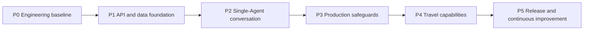

# Travel Assistant Backend Iteration Plan

[中文版本](todo-plan.zh-CN.md)

**Status:** P0 and P1 complete; P2 single-Agent conversation foundation in progress
**Related design:** [Travel Assistant Backend Architecture Design](architecture-design.md)  
**Planning approach:** Deliver milestones with explicit acceptance criteria. Expand scope only after the preceding milestone is complete.

## 0. Delivery sequence

| Priority | Milestone | Goal | Prerequisites |
| --- | --- | --- | --- |
| P0 | Engineering baseline | Repeatable installation, startup, and testing | None |
| P1 | API and data foundation | Callable service with persistent conversations | P0 |
| P2 | Single-Agent conversation | Durable multi-turn and streaming conversations | P1 |
| P3 | Production safeguards | Security, observability, reliability, and evaluation | P1, P2 |
| P4 | Domain capabilities | Preferences, itineraries, retrieval, and human confirmation | P2, P3 |
| P5 | Release and operations | Deployable, recoverable, continuously improved service | P3, P4 |

## P0: Engineering baseline

**Goal:** Establish a maintainable backend foundation without implementing travel business logic.

- [x] Create the `app/`, `tests/`, `docs/`, `scripts/`, and `alembic/` skeleton.
- [x] Add a FastAPI application factory, typed settings, and `/health/live` and `/health/ready` probes.
- [x] Move dependencies to `pyproject.toml`: FastAPI, Uvicorn, Pydantic Settings, LangChain 1.x, LangGraph 1.x, database tooling, and test tooling.
- [x] Standardize development commands through `uv` and `Makefile`: installation, formatting, static checks, tests, startup, and future migrations.
- [x] Complete `.env.example` with safe placeholders and ensure local environment files are ignored.
- [x] Configure Ruff, Pyright, pytest, pre-commit, and base CI.
- [x] Add unit tests for FastAPI health checks. Travel tools will receive their own tests when they are implemented in P2.

**Acceptance criteria:** A new developer can start the health-check service using only the README and `.env.example`; CI runs linting, type checking, and tests.

## P1: API, data, and access control

**Goal:** Provide stable conversation APIs and persistence boundaries before complex Agent behavior.

- [x] Design Pydantic request and response schemas plus a unified error format.
- [x] Build `api/v1` routes for health checks, conversation creation and retrieval, message retrieval, and message submission. Message submission invokes the P2 Agent execution flow; streaming and resume remain P2 work.
- [x] Add PostgreSQL, SQLModel/SQLAlchemy, and Alembic migrations for application-owned identity, conversation, message, run, tool-call, attachment, audit, and future-extension tables. The full schema is defined up front; product capabilities activate incrementally.
- [x] Implement scoped CRUD service layers; route handlers must not construct SQL or call models directly. Conversation persistence remains in `app/services/crud/conversations.py`, without a duplicate repository layer.
- [x] Choose the first identity model: multiple local email/password accounts with JWT; anonymous guest conversations and machine integrations are not supported. Create a public `conversation_id` mapped one-to-one to a stable internal `thread_id` for every conversation.
- [x] Add request IDs, middleware logging context, a CORS allowlist, and base exception handling.
- [x] Add Valkey-backed minimum rate limiting and durable, user-scoped idempotency records. An explicit in-memory rate-limit fallback is allowed only in development.
- [x] Add API integration tests for unauthenticated requests, authorization failures, conversation isolation, pagination, persistence across restart, and error format.

**Acceptance criteria:** Conversations and messages survive an API restart; user A cannot read user B's conversation; all APIs appear in `/docs`.

## P2: Single-Agent conversation runtime

**Goal:** Deliver a recoverable, continuously conversational Agent without graph routing, tool loops, or multi-Agent delegation.

- [x] Define the minimal `TravelAgentState`, runtime context, typed Agent input/output, and append-only message reducer.
- [x] Compile exactly `START → agent → END`. The Agent receives a system prompt and checkpointed history, then appends one reply. This remains the sole graph topology for P2–P5.
- [x] Build an LLM Service for OpenAI-compatible configuration, model registration, call timeouts, retries, and configurable fallback models.
- [x] Integrate LangGraph `PostgresSaver`; every graph call includes the conversation `thread_id`. Add recovery tests across service restarts.
- [x] Implement Responses-style SSE for `POST /messages`: lifecycle, output-item, text-delta, completion, and error events from the single Agent.
- [ ] Add single-Agent unit and integration tests for normal queries, empty model output, provider failure, idempotent replay, and conversation recovery.
- [ ] Define the system prompt versioning, history-window budget, and safe response policy for the single Agent.

**Acceptance criteria:** A user can ask follow-up questions in the same conversation, receive a durable non-streaming or SSE response, and recover the same conversation after a service restart.

## P3: Production safeguards

**Goal:** Make the service diagnosable, protected, and measurable.

- [ ] Complete deferred account capabilities: email verification, password reset, account lifecycle operations, and security-event review. Registration/login, Argon2id password hashing, JWT validation, refresh-session rotation, revocation, expiration, and security-event logging start in P1.
- [ ] Define rate limits by user and IP, concurrent-stream limits, and LLM duration and cost budgets.
- [ ] Define four failure strategies: retry transient errors, return safe Agent failures, clarify user-fixable errors through the prompt, and alert on unexpected errors.
- [ ] Add structured logs and redaction rules for `request_id`, `conversation_id`, `thread_id`, `run_id`, and trace IDs.
- [ ] Add Prometheus metrics and Grafana dashboards for latency, errors, token and cost usage, rate limits, and stream completion.
- [ ] Add LangSmith traces. If the team uses Langfuse, introduce it through an adapter and keep business code vendor-neutral.
- [ ] Create `evals/` with Chinese travel-consultation data and measures for instruction adherence, uncertainty handling, clarification quality, and provider-failure recovery.
- [ ] Add security tests for secret scanning, prompt-injection samples, authorization bypasses, and oversized or malicious message input.
- [ ] Add Dockerfile, Compose, database backup and restore documentation, and CI image builds.

**Acceptance criteria:** Pass one end-to-end load test and failure drill; a problem can be traced by request, run, and trace ID; evaluation regressions can block a release.

## P4: Travel domain capabilities

**Goal:** Improve personalization and itinerary quality on a reliable foundation.

- [ ] Add `travel_preferences` plus explicit APIs for saving, viewing, changing, deleting, and auditing preferences.
- [ ] Pass confirmed preferences into the single Agent as bounded runtime context. Store model-extracted preferences as candidates until user confirmation.
- [ ] Select and add a vector store for user-isolated semantic retrieval of confirmed preferences and high-value travel facts.
- [ ] Add destination facts, route/map, transit, and opening-hours capabilities only through reviewed application-service adapters with source, cache, and test policies; do not add a graph tool loop.
- [ ] Implement `build_itinerary` to create structured itinerary drafts using dates, budget, geography, and opening hours.
- [ ] Keep retrieval sequential and outside graph orchestration until an explicit performance requirement justifies change.
- [ ] Require API-level confirmation for preference writes, itinerary export, and sharing links. Ensure no non-idempotent side effect runs before confirmation.
- [ ] Support itinerary versions, export, and sharing permissions. Booking and payments remain out of scope.

**Acceptance criteria:** A user explicitly manages preferences; itinerary drafts include constraints, sources, freshness, and actionable daily schedules; confirmation flows resume safely.

## P5: Release and continuous improvement

**Goal:** Establish stable releases and a data-driven improvement loop.

- [ ] Write runbooks for environments, secrets, migrations, rollback, backup, and incident response.
- [ ] Validate releases in staging with anonymized evaluation data.
- [ ] Implement versioned releases, health/readiness probes, automated rollback, and change logs.
- [ ] Build operational dashboards and alerts; routinely review failed model/provider calls, low-quality replies, cost, and latency.
- [ ] Create a feedback loop that associates feedback with a specific `run_id`; add only redacted, reviewed feedback to evaluation datasets.
- [ ] Review tool providers, model configuration, privacy-retention periods, and dependency security updates monthly.

**Acceptance criteria:** Complete a staged production-release exercise and a rollback exercise; failures have an owner, alert, and documented recovery process.

## Decisions to confirm before P1

- [x] First identity model: multiple local email/password accounts with JWT; no anonymous conversations or API-key credentials.
- [x] API compatibility target: stable OpenAI Responses-inspired request/response and ordered streaming-event semantics, not zero-change OpenAI SDK compatibility.
- [x] Conversation creation: the first chat request creates a conversation automatically; later requests send the returned `conversation_id`.
- [x] Self-managed accounts: open registration with Argon2id password hashes, email login, JWT access tokens, and rotating refresh tokens. Email verification and password reset are deferred to P3.
- [x] Token lifecycle: short-lived access JWTs, rotating refresh sessions, and server-side revocation state.
- [x] Concurrent writes: one active run per conversation plus idempotency keys for submissions.
- [x] LLM endpoint model: retain arbitrary OpenAI-compatible endpoints; select primary and fallback model names through deployment configuration.
- [ ] Deployment target: single-host Docker Compose, managed containers, or Kubernetes?
- [ ] Is live route, traffic, or opening-hours data needed? Which regions and budget limits apply?
- [x] Sensitive data and retention: do not persist identity documents, contact details, or precise locations; store accessibility/dietary preferences only after confirmation. Retain conversations/checkpoints and run/tool audit data for 180 days after last activity; make explicit deletions unavailable immediately and physically purge within 30 days; retain security audit data for 365 days, idempotency records for 24 hours, and backups for 35 days.
- [ ] Observability choice: LangSmith (recommended) or an existing Langfuse installation? Who owns access and cost?
- [ ] Are languages beyond Chinese required? What are the default timezone and currency rules?

## Do not implement prematurely

- [ ] Do not introduce multi-Agent collaboration, graph routing, graph tool loops, or complex RAG before the single-Agent release is validated.
- [ ] Do not add booking, payment, email sending, or other irreversible actions before identity isolation, auditing, and human confirmation are complete.
- [ ] Do not use subjective examples as the release gate before an evaluation baseline exists.
- [ ] Do not scale concurrency or multi-model fallback before basic metrics and error tracing are complete.
