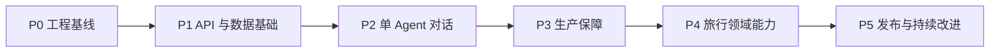

# Travel Assistant 后端迭代计划

[English version](todo-plan.md)

**状态：** P0、P1 已完成；P2 单 Agent 对话基础进行中
**相关设计：** [后端架构设计](architecture-design.zh-CN.md)
**规划方式：** 以具有明确验收条件的里程碑交付；仅在前一里程碑完成后扩展范围。

## 0. 交付顺序

| 优先级 | 里程碑 | 目标 | 前置条件 |
| --- | --- | --- | --- |
| P0 | 工程基线 | 可重复安装、启动与测试 | 无 |
| P1 | API 与数据基础 | 具有持久化会话的可调用服务 | P0 |
| P2 | 单 Agent 对话 | 持久的多轮与流式会话 | P1 |
| P3 | 生产保障 | 安全、可观测、可靠与评估 | P1、P2 |
| P4 | 领域能力 | 偏好、行程、检索与人工确认 | P2、P3 |
| P5 | 发布与运维 | 可部署、可恢复、持续改进的服务 | P3、P4 |

## P0：工程基线

**目标：** 不实现旅行业务逻辑的前提下，建立可维护后端基础。

- [x] 创建 `app/`、`tests/`、`docs/`、`scripts/` 和 `alembic/` 骨架。
- [x] 添加 FastAPI 应用工厂、类型化设置及 `/health/live`、`/health/ready` 探针。
- [x] 在 `pyproject.toml` 管理 FastAPI、Uvicorn、Pydantic Settings、LangChain/LangGraph 1.x、数据库和测试依赖。
- [x] 通过 `uv` 与 `Makefile` 统一安装、格式化、静态检查、测试、启动和迁移命令。
- [x] 补全安全占位符的 `.env.example`，并忽略本地环境文件。
- [x] 配置 Ruff、Pyright、pytest、pre-commit 与基础 CI。
- [x] 为 FastAPI 健康检查添加单元测试；旅行工具在 P2 实现时各自测试。

**验收条件：** 新开发者仅依靠 README 和 `.env.example` 即可启动健康检查服务；CI 运行 lint、类型检查和测试。

## P1：API、数据与访问控制

**目标：** 在复杂 Agent 行为前，提供稳定会话 API 和持久化边界。

- [x] 设计 Pydantic 请求/响应 Schema 和统一错误格式。
- [x] 建立 `api/v1`：健康检查、会话创建/读取、消息读取/提交；提交消息会调用 P2 Agent 流程。
- [x] 为应用拥有的身份、会话、消息、运行、工具调用、附件、审计和未来扩展表添加 PostgreSQL、SQLModel/SQLAlchemy 与 Alembic 迁移。
- [x] 实现范围明确的 CRUD 服务层；路由不得直接构建 SQL 或调用模型。
- [x] 选择多本地邮箱密码账户 + JWT；无匿名会话和机器集成；每个会话将公开 `conversation_id` 一对一映射到稳定内部 `thread_id`。
- [x] 加入请求 ID、中间件日志上下文、CORS 白名单与基础异常处理。
- [x] 加入 Valkey 最低限流和持久、用户范围的幂等记录；内存限流回退仅允许开发环境。
- [x] 加入未认证、越权、会话隔离、分页、重启后持久化和错误格式的 API 集成测试。

**验收条件：** 会话与消息经 API 重启后仍存在；用户 A 无法读取用户 B 会话；所有 API 出现在 `/docs`。

## P2：单 Agent 对话运行时

**目标：** 不引入图路由、工具循环或多 Agent 委派，交付可恢复、连续对话的 Agent。

- [x] 定义最小 `TravelAgentState`、运行时上下文、类型化 Agent 输入/输出和只追加消息 reducer。
- [x] 仅编译 `START → agent → END`；Agent 接收系统提示词和检查点历史，并追加一条回复；P2–P5 始终使用该图拓扑。
- [x] 构建支持 OpenAI 兼容配置、模型注册、调用超时、重试和备用模型的 LLM Service。
- [x] 集成 LangGraph `PostgresSaver`；每次图调用带会话 `thread_id`，并添加跨服务重启恢复测试。
- [x] 为 `POST /messages` 实现 Responses 风格 SSE：生命周期、输出项、文本增量、完成和错误事件。
- [ ] 添加正常查询、空模型输出、供应商失败、幂等重放和会话恢复的单 Agent 单元/集成测试。
- [ ] 定义单 Agent 系统提示词版本化、历史窗口预算和安全回复策略。

**验收条件：** 用户可在同一会话追问，得到持久化的非流式或 SSE 响应，并可在服务重启后恢复相同会话。

## P3：生产保障

**目标：** 让服务可诊断、受保护且可测量。

- [ ] 完成延后的账户能力：邮箱验证、密码重置、账户生命周期和安全事件审查。
- [ ] 定义按用户/IP 的限流、并发流限制及 LLM 时长/成本预算。
- [ ] 定义四类失败策略：重试瞬时错误、返回安全 Agent 失败、通过提示词澄清用户可修复错误、意外错误告警。
- [ ] 为 `request_id`、`conversation_id`、`thread_id`、`run_id` 和 trace ID 添加结构化日志与脱敏规则。
- [ ] 添加 Prometheus 指标和 Grafana 看板，覆盖延迟、错误、token/成本、限流和流完成。
- [ ] 添加 LangSmith trace；若团队使用 Langfuse，则通过适配器保持业务代码厂商中立。
- [ ] 在 `evals/` 中建立中文旅行咨询数据及指令遵从、不确定性处理、澄清质量和供应商失败恢复指标。
- [ ] 添加密钥扫描、提示词注入、鉴权绕过、超大/恶意消息输入的安全测试。
- [ ] 添加 Dockerfile、Compose、备份恢复文档和 CI 镜像构建。

**验收条件：** 通过一次端到端压测和故障演练；问题可按请求、运行和 trace ID 追溯；评估回归可阻断发布。

## P4：旅行领域能力

**目标：** 在可靠基础上提升个性化和行程质量。

- [ ] 添加 `travel_preferences` 及保存、查看、修改、删除、审计偏好的显式 API。
- [ ] 将已确认偏好作为有界运行时上下文传入单 Agent；模型提取偏好先存为候选，待用户确认。
- [ ] 选择并添加用户隔离的向量库，用于已确认偏好和高价值旅行事实的语义检索。
- [ ] 仅通过经过审核的应用服务适配器提供目的地事实、路线/地图、交通和营业时间；带来源、缓存和测试策略；不增加图工具循环。
- [ ] 实现 `build_itinerary`，按日期、预算、地理和营业时间生成结构化行程草案。
- [ ] 除非明确性能需求证明必要，否则检索保持顺序执行并置于图编排之外。
- [ ] 对偏好写入、行程导出与分享链接要求 API 层确认；确认前不得执行非幂等副作用。
- [ ] 支持行程版本、导出与分享权限；预订和支付仍不在范围内。

**验收条件：** 用户可显式管理偏好；行程草案包含约束、来源、时效和可执行的每日安排；确认流可安全恢复。

## P5：发布与持续改进

**目标：** 建立稳定发布和数据驱动的改进闭环。

- [ ] 编写环境、密钥、迁移、回滚、备份和事故响应 runbook。
- [ ] 使用匿名化评估数据在预发布环境验证发布。
- [ ] 实现版本化发布、健康/就绪探针、自动回滚和变更日志。
- [ ] 构建运维看板和告警，定期审查失败模型/供应商调用、低质量回复、成本和延迟。
- [ ] 建立关联具体 `run_id` 的反馈闭环；仅把脱敏并审核后的反馈加入评估集。
- [ ] 每月审查工具供应商、模型配置、隐私留存期与依赖安全更新。

**验收条件：** 完成一次分阶段生产发布演练和一次回滚演练；故障均有负责人、告警和文档化恢复流程。

## P1 前需确认的决策

- [x] 身份模型：多本地邮箱密码账户 + JWT；无匿名会话或 API Key 凭据。
- [x] API 兼容目标：稳定、受 OpenAI Responses 启发的请求/响应与有序流事件语义，不追求 OpenAI SDK 零改动兼容。
- [x] 会话创建：首个聊天请求自动创建会话，后续请求发送返回的 `conversation_id`。
- [x] 自管账户：开放注册、Argon2id 密码哈希、邮箱登录、JWT 和轮换刷新令牌；邮箱验证/密码重置延后至 P3。
- [x] 令牌生命周期：短期访问 JWT、轮换刷新会话和服务端撤销状态。
- [x] 并发写入：每会话一个活跃运行，并使用提交幂等键。
- [x] LLM 端点：保持任意 OpenAI 兼容端点；主/备用模型名由部署配置选择。
- [ ] 部署目标：单机 Docker Compose、托管容器还是 Kubernetes？
- [ ] 是否需要实时路线、交通或营业时间数据？适用地区与预算限制是什么？
- [x] 敏感数据与留存：不持久化证件、联系方式或精确位置；无障碍/饮食偏好确认后才存；会话/检查点/运行与工具审计最后活动后留存 180 天，显式删除立即不可用并在 30 天内物理清除；安全审计 365 天、幂等记录 24 小时、备份 35 天。
- [ ] 可观测选择：LangSmith（推荐）或现有 Langfuse？访问权与成本由谁负责？
- [ ] 是否需要中文以外的语言？默认时区和货币规则是什么？

## 不要过早实现

- [ ] 在单 Agent 发布验证前，不引入多 Agent 协作、图路由、图工具循环或复杂 RAG。
- [ ] 在身份隔离、审计和人工确认完成前，不添加预订、支付、邮件发送或其他不可逆操作。
- [ ] 在评估基线建立前，不用主观示例作为发布门槛。
- [ ] 在基本指标和错误追踪具备前，不扩大并发或多模型回退。
